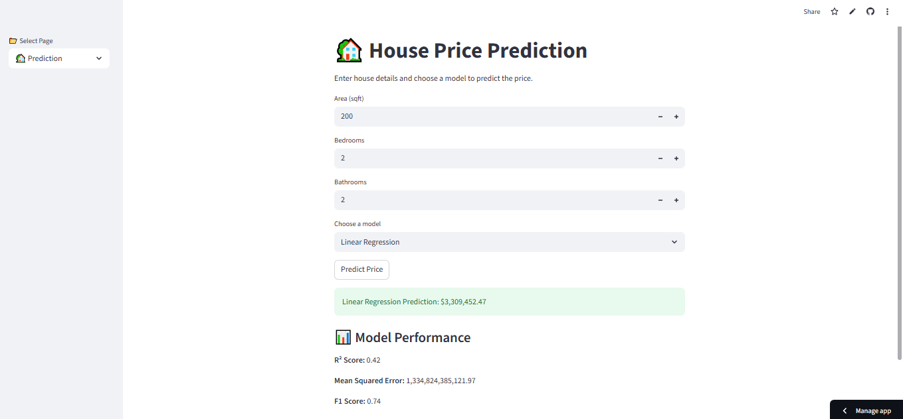
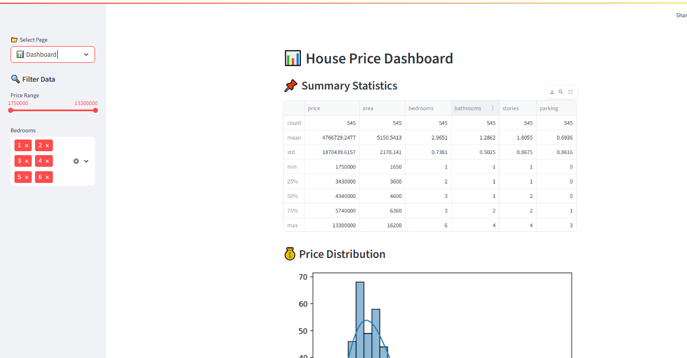

## 📖 About the Project

This project is a machine learning-powered web app that predicts house prices based on user input and provides interactive data insights through a dashboard.

Users can:
- Enter property details (area, bedrooms, bathrooms)
- Choose from multiple ML models to predict house prices
- View model performance metrics (R², MSE, F1 Score)
- Explore a dashboard with charts, filters, and feature analysis

The dashboard includes:
- 📊 Summary statistics and price distribution
- 📐 Area vs Price scatter plot
- 🛏 Bedrooms vs Price bar chart
- 🔍 Filters for price range and bedroom count
- 🌡️ Correlation heatmap of numeric features
- 🌲 Feature importance visualization (Random Forest)

This project demonstrates Amna’s ability to:
- Build and deploy ML models with Streamlit
- Create user-friendly interfaces and dashboards
- Organize code and assets ethically and clearly
- Troubleshoot deployment issues and present polished work

# 🏡 House Price Prediction App

This Streamlit web app predicts house prices based on user input using multiple machine learning models.  
It’s built with Python, scikit-learn, and Streamlit, and deployed live via Streamlit Cloud.

---

## 🚀 Live Demo

👉 [Try the App Here] (https://house-price-prediction-tuvtktrzvhkkmc3vh6ztna.streamlit.app/)

---

## 📦 Features

- Predict house prices using:
  - Linear Regression
  - K-Nearest Neighbors (KNN)
  - Random Forest
  - Support Vector Machine (SVM)
- Scaled input features for better accuracy
- Model performance metrics (R², MSE, F1 Score)
- Clean UI with interactive inputs

---

## 🧠 Technologies Used

- Python
- scikit-learn
- pandas
- Streamlit
- pickle
- GitHub

---
# 🏡 House Price Prediction App

---

## 📸 Screenshot

## 📸 Updated Dashboard Screenshot

## 📁 Project Structure

