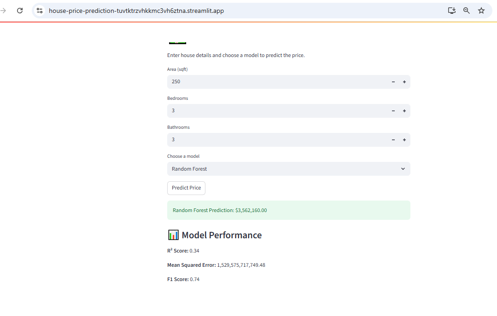

## 📖 About the Project

This project is a machine learning-powered web app that predicts house prices based on user input.  
It allows users to enter property details—such as area, number of bedrooms, and bathrooms—and choose from four different models to generate a price estimate.

The app is built using:
- **Python** for data processing and modeling
- **scikit-learn** for training regression models
- **Streamlit** for creating the interactive web interface
- **pickle** for saving and loading trained models

It also displays performance metrics (R², MSE, F1 Score) for each model, helping users understand how well each algorithm performs.

This project demonstrates Amna’s ability to:
- Build and deploy ML models
- Create user-friendly interfaces
- Organize code and assets ethically and clearly
- Troubleshoot deployment issues and present polished work

# 🏡 House Price Prediction App

This Streamlit web app predicts house prices based on user input using multiple machine learning models.  
It’s built with Python, scikit-learn, and Streamlit, and deployed live via Streamlit Cloud.

---

## 🚀 Live Demo

👉 [Try the App Here] (https://house-price-prediction-tuvtktrzvhkkmc3vh6ztna.streamlit.app/)

---

## 📦 Features

- Predict house prices using:
  - Linear Regression
  - K-Nearest Neighbors (KNN)
  - Random Forest
  - Support Vector Machine (SVM)
- Scaled input features for better accuracy
- Model performance metrics (R², MSE, F1 Score)
- Clean UI with interactive inputs

---

## 🧠 Technologies Used

- Python
- scikit-learn
- pandas
- Streamlit
- pickle
- GitHub

---
# 🏡 House Price Prediction App

---

## 📸 Screenshot

## 📁 Project Structure

